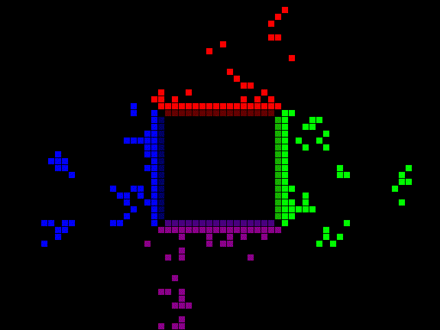

My friends made fun of me for not being artistic... so I decided to write some C++ code to generate some art!

Wanting to brush up on my C++, I developed this in C++ with minimal dependencies (just [SDL](https://packages.ubuntu.com/search?keywords=sdl2)). Being fascinated by [cellular automata](https://en.wikipedia.org/wiki/Cellular_automaton), I wanted to see if I could draw anything by only giving an initial condition to a cell board that is updated according to set rules. As an addition to make life easier, I also allowed for the use of probabilistic evolution from one state to the next (to have a way of imposing different "speeds" to different phenomenons).

First drawing made was the tree here on the bottom. Turns out that the nicest thing about the tree drawing was the smoke, so I made another with the smoke only.

